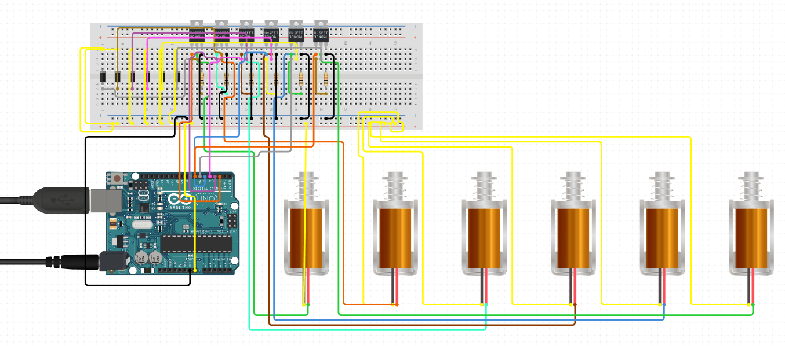

# Text-to-Braille-Reader
The purpose of this project is to design and develop an Arduino-based assistive device that empowers blind and deaf individuals to communicate and interact with new people using a laptop interface. The device integrates hardware and software components to enable real-time conversion of textual characters into Braille.

## Objectives
1. Prototyping the device to convert text to Braille output using six solenoids operating as a braille cell.
2. Developing a Python script to send characters from a laptop to the Arduino for conversion.
3. Implementing UART communication for data transmission between the laptop and the Arduino.

The next objective of this project is to prototype this device using 30 solenoids in total creating 5 braille cells (eqivalent to transmitting 5 characters at once). Once proof-of-concept is finalized a printed circuit board (PCB) will be designed and developed.

## Main Components
1. Arduino Uno R3
2. 12 V Power Supply
3. 6 N-Channel MOSFET 60V 30A
4. 6 Push-Pull Solenoids
5. 6 1N4001 Rectifier Diodes - 1A 50V

## Prototype Circuit Schematic 

  

 
